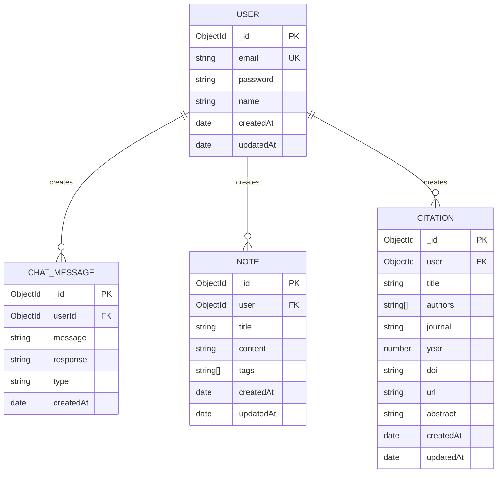

# Entity-Relationship (ER) Diagram
## AI Research Assistant - StudyMate

---

## ER Diagram (Mermaid Format)



---

## Entity Definitions

### 1. USER Entity
**Purpose:** Stores user account information and authentication credentials

| Attribute | Type | Constraint | Description |
|-----------|------|-----------|-------------|
| `_id` | ObjectId | PRIMARY KEY | Unique identifier for user |
| `email` | String | UNIQUE, REQUIRED | User email address (used for login) |
| `password` | String | REQUIRED, MIN 6 | Hashed password using bcryptjs |
| `name` | String | REQUIRED | User's full name |
| `createdAt` | Date | REQUIRED | Timestamp of account creation |
| `updatedAt` | Date | REQUIRED | Last update timestamp |

**Key Methods:**
- `comparePassword(candidatePassword)` - Verifies password during authentication

---

### 2. CHAT_MESSAGE Entity
**Purpose:** Stores AI chat conversations and interactions

| Attribute | Type | Constraint | Description |
|-----------|------|-----------|-------------|
| `_id` | ObjectId | PRIMARY KEY | Unique identifier for message |
| `userId` | ObjectId | FOREIGN KEY → USER._id, REQUIRED | Reference to the user who created the message |
| `message` | String | REQUIRED | User's input message |
| `response` | String | REQUIRED | AI-generated response |
| `type` | String | ENUM: ['chat', 'research', 'references'], DEFAULT: 'chat' | Message type classification |
| `createdAt` | Date | DEFAULT: Date.now | Timestamp of message creation |

**Relationships:**
- **One-to-Many**: One USER can have many CHAT_MESSAGES

---

### 3. NOTE Entity
**Purpose:** Stores user research notes with organizational features

| Attribute | Type | Constraint | Description |
|-----------|------|-----------|-------------|
| `_id` | ObjectId | PRIMARY KEY | Unique identifier for note |
| `title` | String | REQUIRED | Note title/heading |
| `content` | String | REQUIRED | Note body content |
| `user` | ObjectId | FOREIGN KEY → USER._id, REQUIRED | Reference to the note owner |
| `tags` | String[] | OPTIONAL | Array of searchable tags |
| `createdAt` | Date | REQUIRED | Timestamp of note creation |
| `updatedAt` | Date | REQUIRED | Last modification timestamp |

**Relationships:**
- **One-to-Many**: One USER can have many NOTES

---

### 4. CITATION Entity
**Purpose:** Stores academic citation information with multiple metadata fields

| Attribute | Type | Constraint | Description |
|-----------|------|-----------|-------------|
| `_id` | ObjectId | PRIMARY KEY | Unique identifier for citation |
| `title` | String | REQUIRED | Citation/Paper title |
| `authors` | String[] | REQUIRED | Array of author names |
| `journal` | String | OPTIONAL | Journal/Publication name |
| `year` | Number | OPTIONAL | Publication year |
| `doi` | String | OPTIONAL | Digital Object Identifier |
| `url` | String | OPTIONAL | Web link to resource |
| `abstract` | String | OPTIONAL | Paper abstract/summary |
| `user` | ObjectId | FOREIGN KEY → USER._id, REQUIRED | Reference to citation owner |
| `createdAt` | Date | REQUIRED | Timestamp of citation creation |
| `updatedAt` | Date | REQUIRED | Last modification timestamp |

**Relationships:**
- **One-to-Many**: One USER can have many CITATIONS

---

## Relationship Diagram

### One-to-Many Relationships

```
┌─────────────────┐
│      USER       │
│                 │
│ _id (PK)        │
│ email (UK)      │
│ password        │
│ name            │
│ createdAt       │
│ updatedAt       │
└────────┬────────┘
         │
         │ 1..N
         ├─────────────────────┬──────────────────┬─────────────────┐
         │                     │                  │                 │
         ▼ 1..N                ▼ 1..N             ▼ 1..N             ▼ 1..N
┌─────────────────┐   ┌─────────────────┐  ┌─────────────────┐  ┌─────────────────┐
│  CHAT_MESSAGE   │   │      NOTE       │  │    CITATION     │  │   (Future)      │
│                 │   │                 │  │                 │  │   Entities      │
│ _id (PK)        │   │ _id (PK)        │  │ _id (PK)        │  │                 │
│ userId (FK)     │   │ user (FK)       │  │ user (FK)       │  │                 │
│ message         │   │ title           │  │ title           │  │                 │
│ response        │   │ content         │  │ authors[]       │  │                 │
│ type            │   │ tags[]          │  │ journal         │  │                 │
│ createdAt       │   │ createdAt       │  │ year            │  │                 │
│                 │   │ updatedAt       │  │ doi             │  │                 │
│                 │   │                 │  │ url             │  │                 │
│                 │   │                 │  │ abstract        │  │                 │
│                 │   │                 │  │ createdAt       │  │                 │
│                 │   │                 │  │ updatedAt       │  │                 │
└─────────────────┘   └─────────────────┘  └─────────────────┘  └─────────────────┘
```

---

## Cardinality Notation

| Notation | Meaning | Example |
|----------|---------|---------|
| `1..1` | One to One | One user has one unique email |
| `1..N` or `1..*` | One to Many | One user has many notes |
| `M..N` or `*...*` | Many to Many | (Not currently used) |

**Current Cardinality in System:**
- **USER → CHAT_MESSAGE**: `1..N` (One user creates many chat messages)
- **USER → NOTE**: `1..N` (One user creates many notes)
- **USER → CITATION**: `1..N` (One user creates many citations)

---

## Normalization Status

### First Normal Form (1NF)
- ✅ All attributes are atomic
- ✅ No repeating groups (arrays are properly defined)
- ✅ Each column contains single-valued entries

### Second Normal Form (2NF)
- ✅ All non-key attributes are fully dependent on the primary key
- ✅ No partial dependencies
- ✅ Foreign keys properly reference primary keys

### Third Normal Form (3NF)
- ✅ No transitive dependencies
- ✅ All attributes depend directly on primary key
- ✅ Relationships are properly isolated in separate entities

---

## Data Flow

```
┌──────────────────────────────────────────────────────────┐
│                      FRONTEND                             │
│              (Next.js + React + TypeScript)               │
└────────────────────────┬─────────────────────────────────┘
                         │
                         │ HTTP/REST API
                         │
┌────────────────────────▼─────────────────────────────────┐
│                      BACKEND                              │
│              (Express.js + Node.js)                       │
└────────────────────────┬─────────────────────────────────┘
                         │
                         │ Mongoose ODM
                         │
┌────────────────────────▼─────────────────────────────────┐
│                    DATABASE                               │
│                    (MongoDB)                              │
│                                                           │
│  ┌──────────┐  ┌──────────┐  ┌──────────┐  ┌──────────┐ │
│  │   User   │  │ChatMsg   │  │  Notes   │  │Citation  │ │
│  │ Collection│  │Collection│  │Collection│  │Collection│ │
│  └──────────┘  └──────────┘  └──────────┘  └──────────┘ │
└──────────────────────────────────────────────────────────┘
```

---

## Index Strategy

### Recommended Indexes for Performance

```javascript
// User Collection
db.users.createIndex({ email: 1 }, { unique: true })

// Chat Message Collection
db.chatmessages.createIndex({ userId: 1 })
db.chatmessages.createIndex({ createdAt: -1 })
db.chatmessages.createIndex({ userId: 1, createdAt: -1 })

// Note Collection
db.notes.createIndex({ user: 1 })
db.notes.createIndex({ createdAt: -1 })
db.notes.createIndex({ tags: 1 })
db.notes.createIndex({ user: 1, createdAt: -1 })

// Citation Collection
db.citations.createIndex({ user: 1 })
db.citations.createIndex({ createdAt: -1 })
db.citations.createIndex({ user: 1, createdAt: -1 })
db.citations.createIndex({ doi: 1 })
```

---

## Example Queries Based on ER Model

### Query 1: Get all notes for a specific user
```javascript
db.notes.find({ user: userId }).sort({ createdAt: -1 })
```

### Query 2: Get all chat messages and their user information
```javascript
db.chatmessages.aggregate([
  {
    $lookup: {
      from: "users",
      localField: "userId",
      foreignField: "_id",
      as: "userInfo"
    }
  }
])
```

### Query 3: Get user's citations with recent creation date
```javascript
db.citations.find({ user: userId }).sort({ createdAt: -1 }).limit(10)
```

### Query 4: Count messages by type for a user
```javascript
db.chatmessages.aggregate([
  { $match: { userId: userId } },
  { $group: { _id: "$type", count: { $sum: 1 } } }
])
```

---

## Data Integrity Constraints

### Foreign Key Constraints
- `ChatMessage.userId` → Must reference valid `User._id`
- `Note.user` → Must reference valid `User._id`
- `Citation.user` → Must reference valid `User._id`

### Unique Constraints
- `User.email` → Must be unique across all users

### Required Fields
- **User**: email, password, name
- **ChatMessage**: userId, message, response
- **Note**: title, content, user
- **Citation**: title, authors, user

### Validation Rules
- Email format validation
- Password minimum length (6 characters)
- Year field should be a valid number (optional)
- DOI format validation (optional)

---

## Future Extensibility

### Potential New Entities
1. **Research Project** - Group related notes and citations
2. **Collaboration** - Share research with other users
3. **Comments** - Add discussions to notes/citations
4. **Tags/Categories** - Separate tag management entity
5. **API Keys** - Manage third-party integrations
6. **Audit Log** - Track all user activities

### Potential Relationships
- Research Project ←→ Notes (1..N)
- Research Project ←→ Citations (1..N)
- User ←→ User (via Collaboration) (M..N)
- Note ←→ Comment (1..N)
- Citation ←→ Comment (1..N)

---

## Summary

The ER diagram represents a well-normalized relational structure implemented in MongoDB:

- **4 Main Entities**: User, Chat Message, Note, Citation
- **Relationship Type**: One-to-Many (User-centric)
- **Primary Key**: ObjectId for all entities
- **Foreign Keys**: userId/user fields linking to User entity
- **Normalization**: Fully normalized to 3NF
- **Scalability**: Supports efficient querying and indexing

This design ensures data integrity, eliminates redundancy, and provides a solid foundation for future enhancements and scaling.

---

**Document Created:** December 6, 2025  
**Database System:** MongoDB  
**Normalization Level:** Third Normal Form (3NF)  
**Version:** 1.0
