# System Flowcharts
## AI Research Assistant - StudyMate

---

## 1. Application Startup Flow

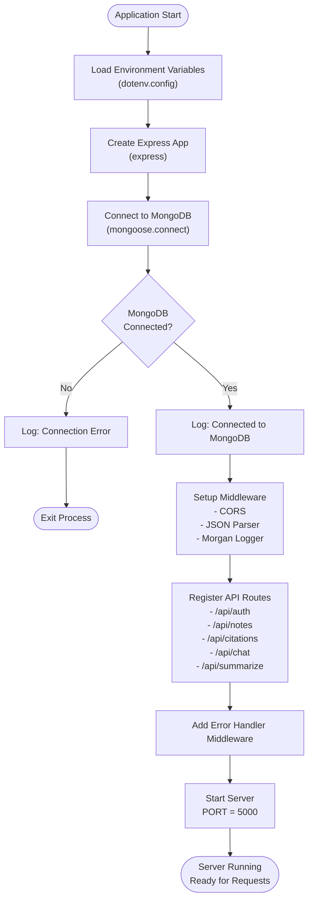

---

## 2. User Authentication Flow

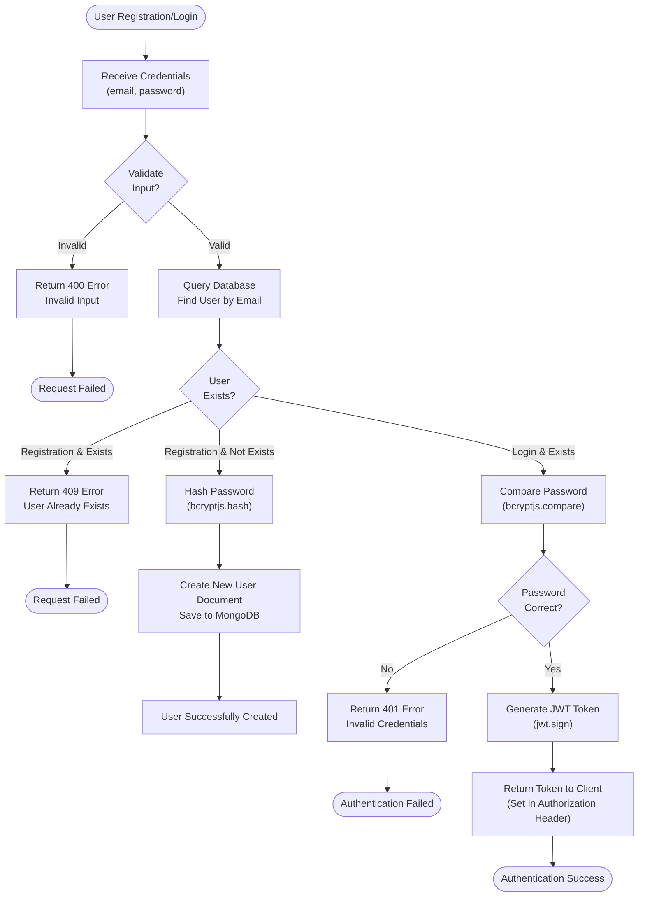

---

## 3. Chat/AI Interaction Flow

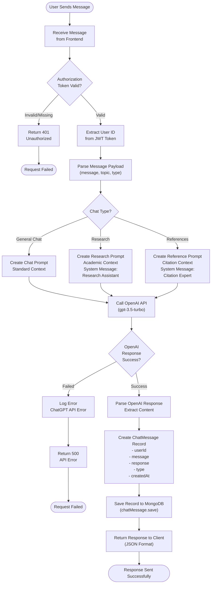

---

## 4. Chat History Retrieval Flow

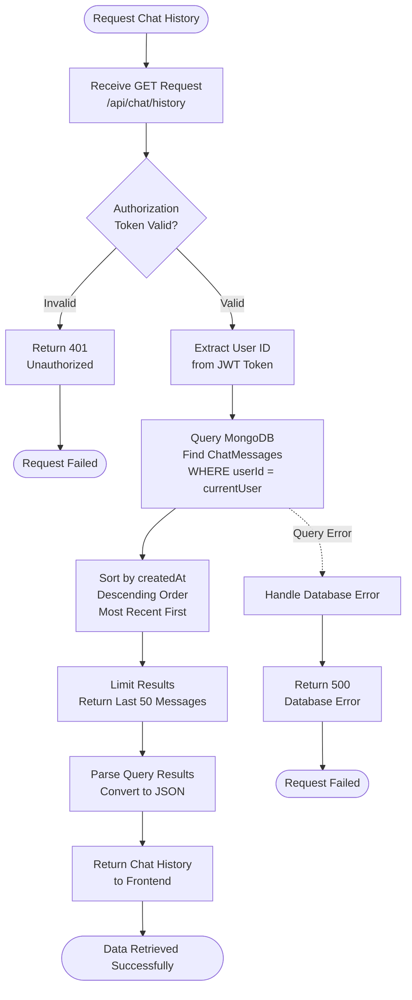

---

## 5. Note Management Flow

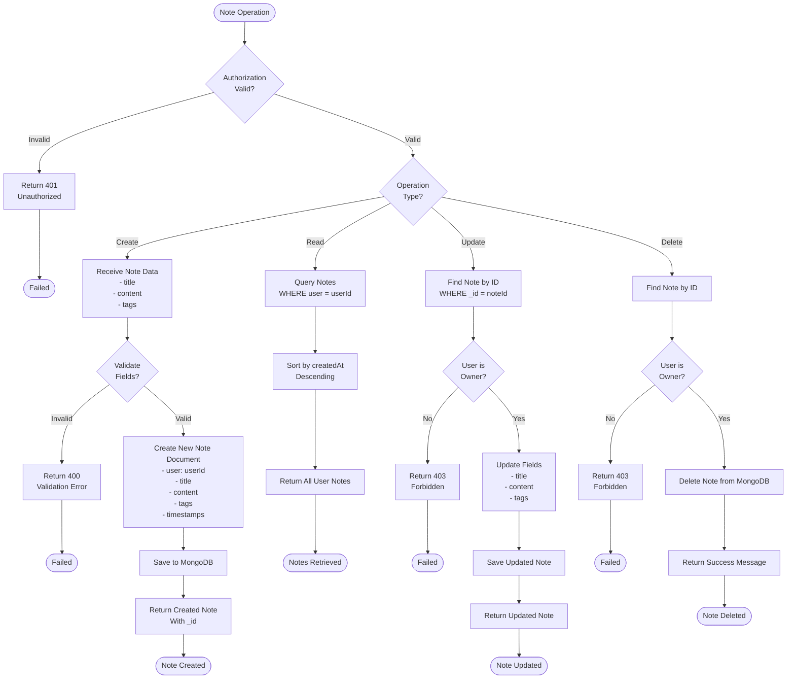

---

## 6. Citation Management Flow

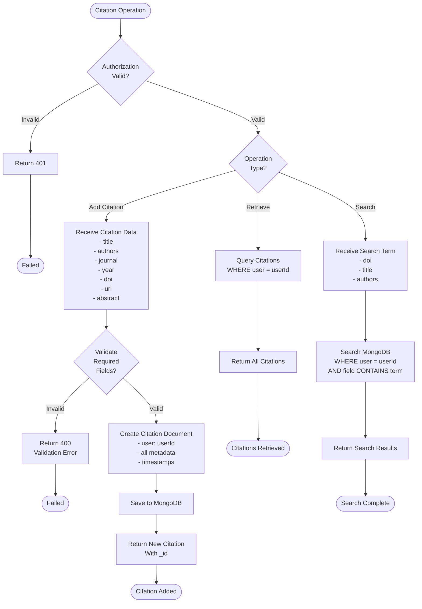

---

## 7. Request-Response Cycle

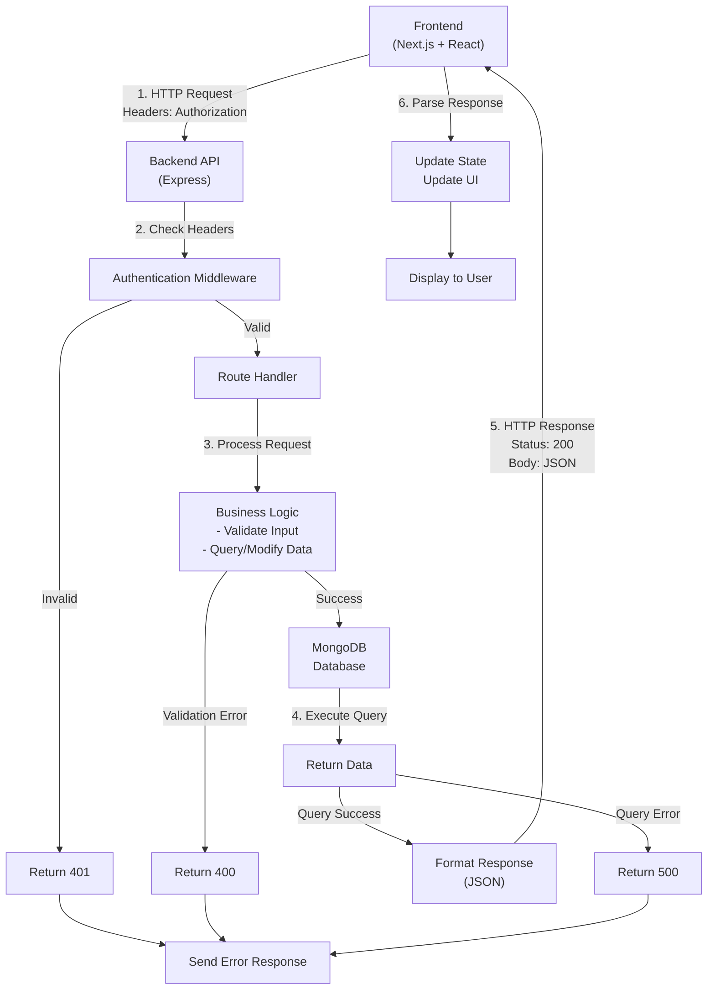

---

## 8. Error Handling Flow

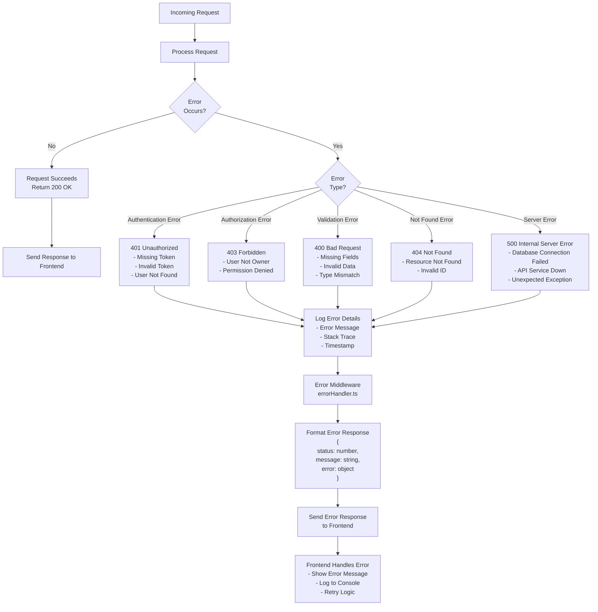

---

## 9. Data Flow Through Stack

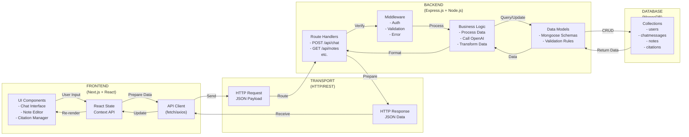

---

## 10. Authentication Token Flow

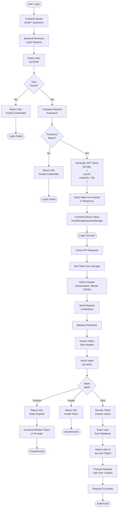

---

## 11. OpenAI Integration Flow

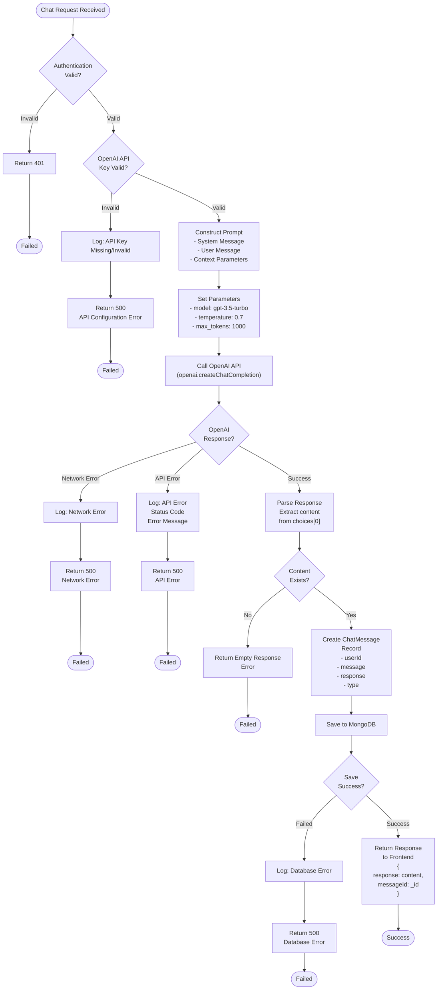

---

## 12. Data Persistence Flow

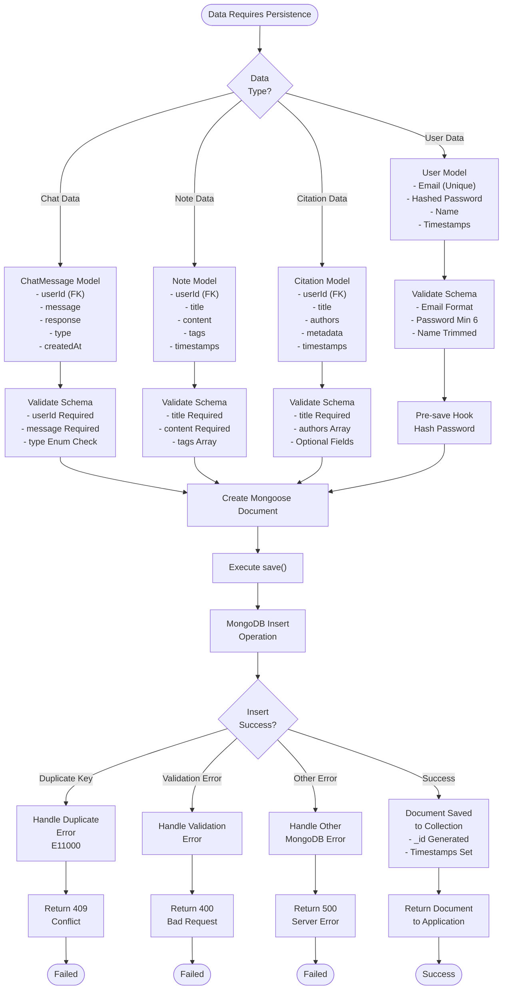

---

## Summary of Flows

| Flow # | Name | Purpose |
|--------|------|---------|
| 1 | Application Startup | Initialize server and connect to database |
| 2 | Authentication | User registration and login |
| 3 | Chat/AI Interaction | Process user messages with OpenAI |
| 4 | Chat History | Retrieve conversation history |
| 5 | Note Management | CRUD operations on notes |
| 6 | Citation Management | CRUD operations on citations |
| 7 | Request-Response Cycle | Complete HTTP request lifecycle |
| 8 | Error Handling | Handle and respond to errors |
| 9 | Data Flow Through Stack | Track data from UI to database |
| 10 | Authentication Token | JWT generation and validation |
| 11 | OpenAI Integration | API calls and response handling |
| 12 | Data Persistence | Save data to MongoDB |

---

**Document Created:** December 6, 2025  
**System:** AI Research Assistant - StudyMate  
**Version:** 1.0
