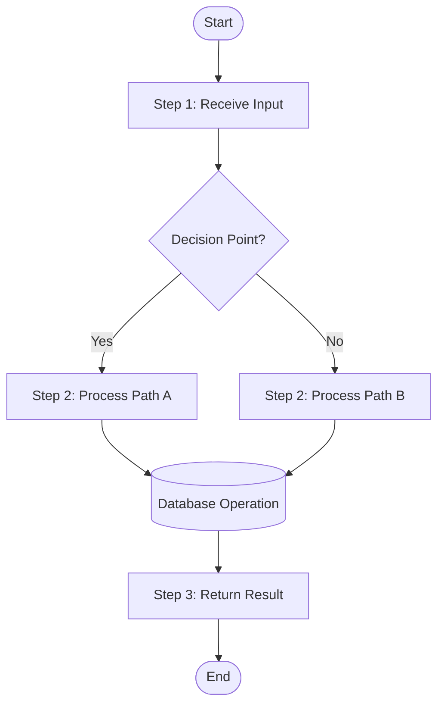
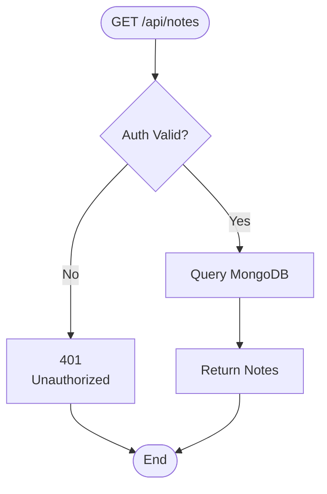
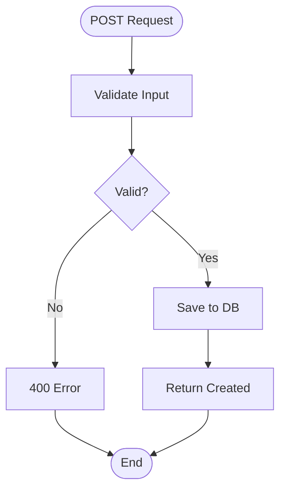
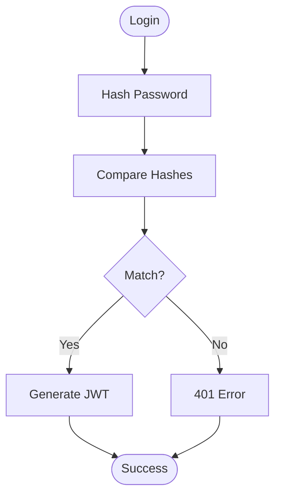
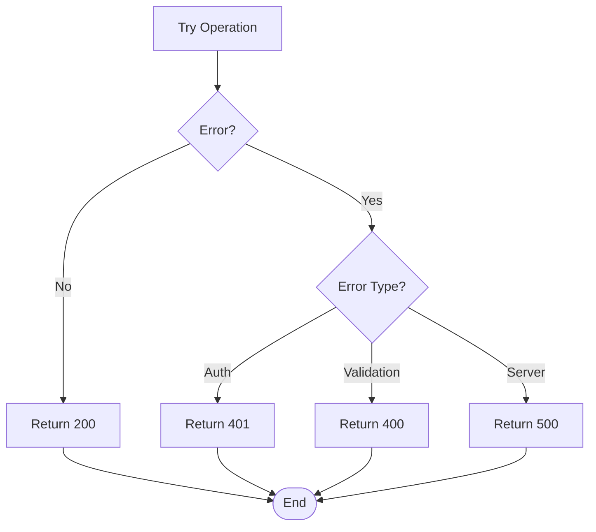
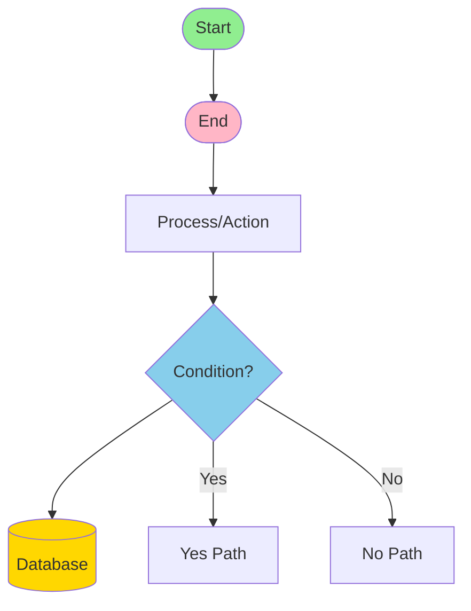
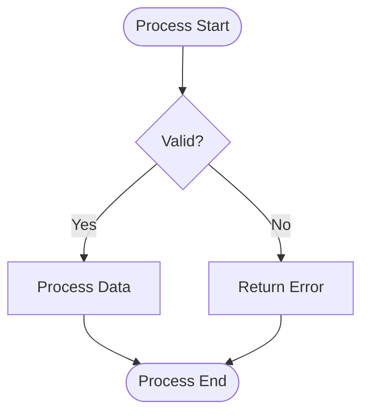

# Quick Flowchart Structure Guide
## AI Research Assistant - StudyMate

---

## Core Components Structure

```
┌─────────────────────────────────────────┐
│         FLOWCHART BUILDING BLOCKS        │
└─────────────────────────────────────────┘

1. START/END
   ([Label])

2. PROCESS
   [Action/Operation]

3. DECISION
   {Question?}

4. DATA/DATABASE
   [(Database Operation)]

5. ARROW FLOW
   --> (flow direction)

6. CONDITIONS
   -->|Yes| or -->|No|
```

---

## 7-Step Flowchart Template



---

## Quick Reference for Your Code

### Request Lifecycle (3-Step)
```
[Request Received]
    ↓
[Auth Check + Process]
    ↓
[Return Response]
```

### Database Operation (4-Step)
```
[Find/Create Document]
    ↓
[Validate Data]
    ↓
[Save to DB]
    ↓
[Return Result]
```

### Error Handling (2-Step)
```
[Error Occurs?]
    ↓
[Yes: Return Error Code | No: Continue]
```

---

## Minimal Flowchart Examples

### 1. Simple API Endpoint


### 2. Create Operation


### 3. Authentication


### 4. Error Handling


---

## Symbols Quick Guide

| Symbol | Meaning | Used For |
|--------|---------|----------|
| `()` | Oval | Start/End |
| `[]` | Rectangle | Process/Action |
| `{}` | Diamond | Decision/Condition |
| `[()]` | Cylinder | Database/Storage |
| `-->` | Arrow | Flow Direction |
| `\|label\|` | Condition | Yes/No paths |

---

## For Your Code Sections

### Backend Routes Pattern
```
Request → Auth Middleware → Route Handler → Business Logic → DB Query → Response
```

### Frontend to Backend Pattern
```
User Action → State Update → API Call → Auth Header → Backend Processing → State Update → UI Render
```

### OpenAI Integration Pattern
```
User Message → Format Prompt → Call OpenAI API → Parse Response → Save to DB → Return to Frontend
```

---

## Mermaid Syntax Cheat Sheet



---

## Step-by-Step: Create a Flowchart

### Step 1: Identify the Process
- What triggers it? (Request, User action, Event)
- What are the main steps? (3-5 steps)
- What decisions are made? (Conditionals)

### Step 2: List Components
- **Input**: What enters the process?
- **Processing**: What operations happen?
- **Decisions**: Any if/else logic?
- **Output**: What's returned?
- **Error Paths**: What if it fails?

### Step 3: Map the Flow
```
START
  ↓
INPUT VALIDATION
  ↓
DECISION POINT
  ├─→ SUCCESS PATH
  │     ↓
  │   PROCESS
  │     ↓
  │   RETURN SUCCESS
  │
  └─→ FAILURE PATH
        ↓
      RETURN ERROR
  ↓
END
```

### Step 4: Implement in Mermaid


---

## Common Patterns in Your Code

### Pattern 1: Authentication Check
```
├─ Extract Token
├─ Verify Token
├─ Find User
└─ Return User or 401
```

### Pattern 2: CRUD Operation
```
├─ Auth Check
├─ Validate Input
├─ Query/Modify DB
├─ Handle Result
└─ Return Response
```

### Pattern 3: AI Integration
```
├─ Auth Check
├─ Format Request
├─ Call API
├─ Parse Response
├─ Save to DB
└─ Return to Client
```

### Pattern 4: Error Handling
```
├─ Try Operation
├─ Catch Error
├─ Determine Type
├─ Return Status Code
└─ Log Error
```

---

## Online Tools

- **Mermaid Live**: https://mermaid.live/
- **Draw.io**: https://app.diagrams.net/
- **Lucidchart**: https://www.lucidchart.com/

---

## Tips for Better Flowcharts

✅ **DO:**
- Keep flowcharts simple (5-10 boxes max)
- Use clear, concise labels
- Show both success and error paths
- Group related operations
- Use consistent arrow directions

❌ **DON'T:**
- Overcomplicate with too many branches
- Use unclear abbreviations
- Mix different diagram types
- Make boxes too small
- Create circular flows without reason

---

## Quick Examples for Your Features

### Notes Feature Flow
```
User Action (Create/Read/Update/Delete)
    ↓
Auth Validation
    ↓
Input Validation
    ↓
Database Operation
    ↓
Return Result
```

### Chat Feature Flow
```
User Message
    ↓
Auth Validation
    ↓
Call OpenAI
    ↓
Save Response
    ↓
Return to User
```

### Citation Feature Flow
```
Citation Input
    ↓
Auth Validation
    ↓
Validate Citation Data
    ↓
Save to Database
    ↓
Return Citation
```

---

## Summary

**Minimal Components Needed:**
1. Start point
2. Key processing steps (2-5)
3. Decision points (if any)
4. End point

**Color Coding (Optional):**
- Green: Start/Success
- Blue: Processes
- Yellow: Decisions/Database
- Red: End/Errors

---

**Last Updated:** December 6, 2025  
**For:** AI Research Assistant - StudyMate
