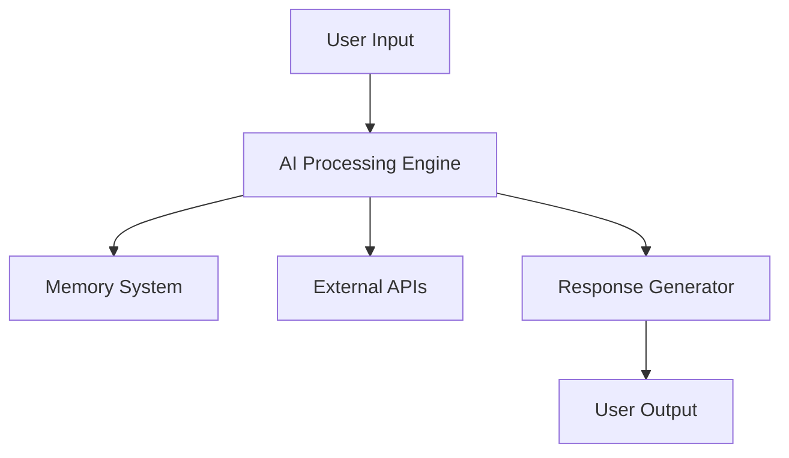

<h1 align="center">🤖 AI RESEARCH ASSISTANT</h1>

<p align="center">
  
</p>

<p align="center">
  
</p>

<p align="center">
  <b>⚡ [ AI CORE ACTIVE ] ⚡</b><br>
  <i>Transforming Data into Intelligence • Faster • Smarter • Better</i>
</p>

---

<p align="center">
  
  
  
  
</p>

---

## 🚀 About The Project

> 🧠 A powerful AI-driven research assistant designed to automate analysis, generate insights, and accelerate productivity.

🔍 Whether you're a student, developer, or researcher — this system helps you:

* Extract meaningful insights from data
* Automate repetitive research tasks
* Generate intelligent responses
* Improve decision-making with AI

---

## ⚡ Core Features

✨ Intelligent Query Processing
📊 Data Analysis & Summarization
🤖 AI-Powered Response Generation
🧠 Memory System (Context Awareness)
🌐 Web Search Integration *(optional)*
📁 File & Document Handling

---

## 🛠️ Tech Stack

| Technology         | Role                |
| ------------------ | ------------------- |
| ⚛️ Next.js 14      | Frontend            |
| 🟢 Node.js         | Backend             |
| 🧠 Gemini / AI API | Intelligence Engine |
| 🗄️ MongoDB        | Database            |
| 🎨 Tailwind CSS    | UI                  |

---

## 🧩 System Architecture



---

## ⚙️ Installation & Setup

```bash
git clone https://github.com/your-username/ai-research-assistant.git
cd ai-research-assistant
npm install
npm run dev
```

## 🔮 Future Enhancements

🚀 Voice Assistant Integration
📡 Real-time Web Intelligence
🧠 Advanced Memory & Personalization
📱 Mobile App Version
🛰️ Autonomous Research Mode

---

## 🤝 Contributing

We welcome contributions!

1. Fork the repository
2. Create your feature branch
3. Commit your changes
4. Push to GitHub
5. Open a Pull Request

---

## 📜 License

MIT License © 2026

---

<p align="center">
  ⚡ Built with Passion • Powered by AI ⚡
</p>
